# Ejercicios control 1

```{r}
library(readxl)
```

## Sumatorias

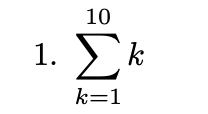

```{r}
sum(c(1:10))
```

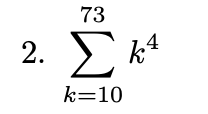

```{r}
v1 <- c(10:73)
suma <- 0
for(i in v1){
  suma <- suma + i**4
}
suma
```

o

```{r}
v1 <- c(10:73)
v1 <- v1**4
sum(v1)
```

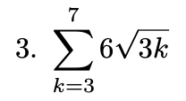

```{r}
v1 <- c(3:7)
suma <- 0
for(i in v1){
  suma <- suma + 6*sqrt(3*i)
}
suma
```

o

```{r}
v1 <- c(3:7)
v1 <- sqrt(v1*3)*6
sum(v1)
```

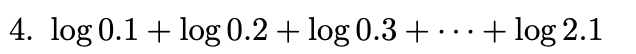

```{r}
v1 <- c(1:21)
suma <- 0
for(i in v1){
  suma <- suma + log(i/10)
}
suma
```

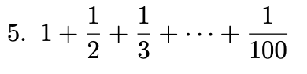

```{r}
v1 <- c(1:100)
suma <- 0
for(i in v1){
  suma <- suma + 1/i
}
suma
```

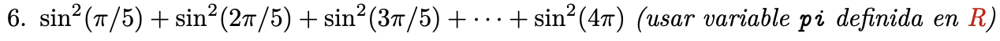

```{r}
v1 <- c(1:20)
suma <- 0
for(i in v1){
  suma <- suma + sin(pi*i/5)**2
}
suma
```

## Probabilidades

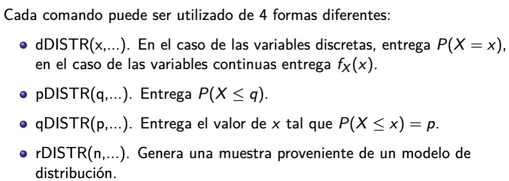 DISTR corresponde a la distribucion que se esta utilizando. Por ejemplo, alguna de las siguientes: 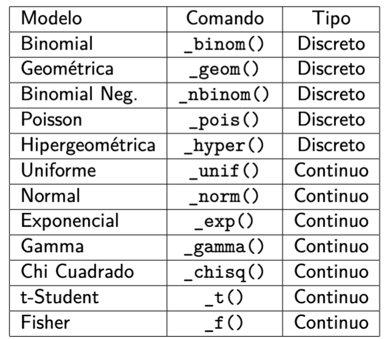

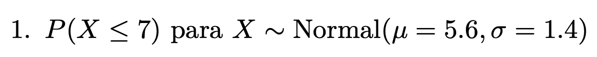

```{r}
muestra1 <- pnorm(7, mean=5.6, sd=1.4)
muestra1
```

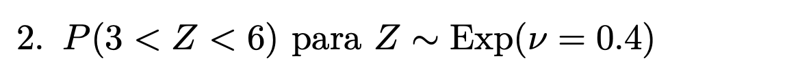

```{r}
muestra1 <- pexp(3, 0.4)
muestra2 <- pexp(6, 0.4)
muestra2 - muestra1
```

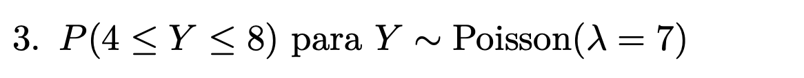 Como es discreta al restar la probabilidad hasta el 8 con la que es hasta el 4 perdemos la info de la probabilidad del 4

```{r}
muestra1 <- ppois(4, 7)
muestra2 <- ppois(8, 7)
dato1 <- dpois(4, 7)
muestra2 - muestra1 + dato1
```

o

```{r}
muestra1 <- ppois(3, 7)
muestra2 <- ppois(8, 7)
muestra2 - muestra1 
```

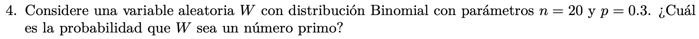

```{r}
primos <- c(2,3,5,7,11,13,17,19)
suma <- 0
for(i in primos){
    suma <- suma + dbinom(i, 20, 0.3)     
}
suma
```

## Bases de datos

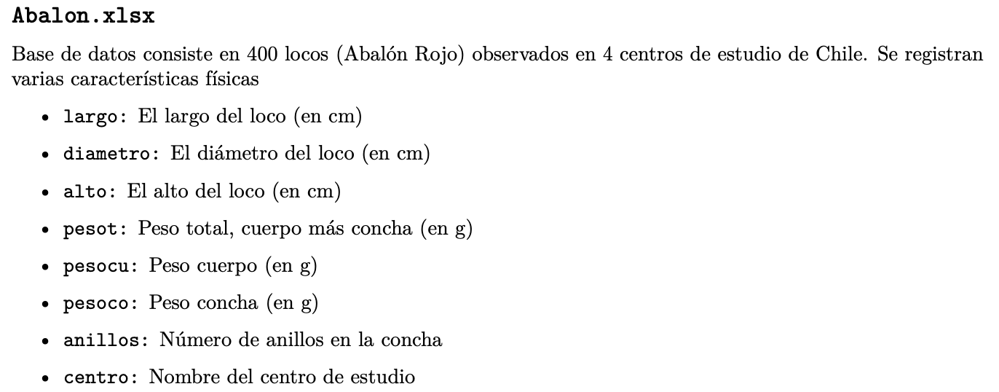

```{r}
Abalon <- read_excel("Data/Abalon.xlsx")
```

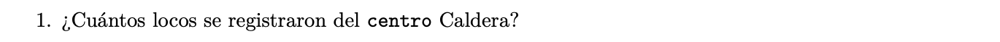

```{r}
Caldera <- Abalon$centro == "Caldera"
cantidad <- sum(Caldera)
cantidad
```

o

```{r}
nrow(subset(Abalon, centro == "Caldera"))
```

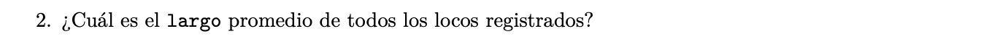

```{r}
suma_largos <- sum(Abalon$largo)
cantidad <- nrow(Abalon)
promedio <- suma_largos/cantidad
promedio
```

o

```{r}
mean(Abalon$largo)
```

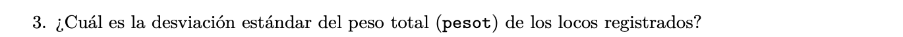

```{r}
sd(Abalon$pesot)
```


```{r}
condicion1 <- Abalon$centro == "Coquimbo"
suma <- sum(Abalon$pesot[condicion1])
cantidad <- nrow(Abalon[condicion1, ])
suma/cantidad

```

o

```{r}
condicion1 <- Abalon$centro == "Coquimbo"
mean(Abalon[condicion1, ]$pesot)
```

o

```{r}
mean(Abalon[Abalon$centro == "Coquimbo", ]$pesot)
```


```{r}
condicion1 <- Abalon$largo > 10
suma <- sum(Abalon$largo[condicion1])
cantidad <- nrow(Abalon[condicion1, ])
suma/cantidad
```

o

```{r}
condicion1 <- Abalon$largo > 10
mean(Abalon[condicion1, ]$largo)
```

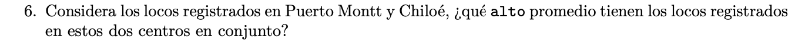

```{r}
condicion1 <- Abalon$centro == "Chiloé"
condicion2 <- Abalon$centro == "Puerto Montt"
suma <- sum(Abalon$alto[condicion1 | condicion2])
cantidad <- nrow(Abalon[condicion1 | condicion2, ])
suma/cantidad
```

o

```{r}
condicion1 <- Abalon$centro == "Chiloé"
condicion2 <- Abalon$centro == "Puerto Montt"
mean(Abalon[condicion1 | condicion2, ]$alto)
```


```{r}
nrow(Abalon[Abalon$anillos >= 12, ])
```

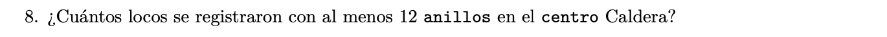

```{r}
nrow(Abalon[Abalon$anillos >= 12 & Abalon$centro == "Caldera", ])
```

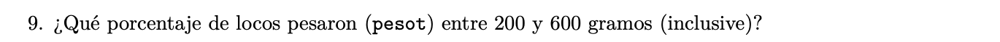

```{r}
total <- nrow(Abalon)
(nrow(Abalon[Abalon$pesot >= 200 & Abalon$pesot <= 600, ]))/total
```

o

```{r}
total <- nrow(Abalon)
condicion1 <- Abalon$pesot >= 200
condicion2 <- Abalon$pesot <= 600
(nrow(Abalon[condicion1 & condicion2, ]))/total
```

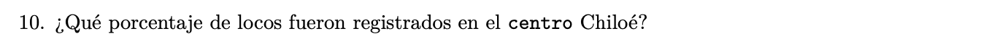

```{r}
total <- nrow(Abalon)
(nrow(Abalon[Abalon$centro == "Chiloé", ]))/total
```

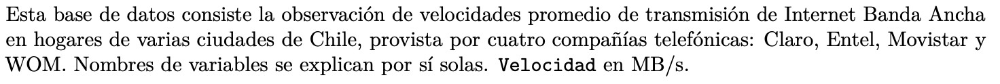

```{r}
BandaAncha <- read_excel("Data/BandaAncha.xlsx")
```

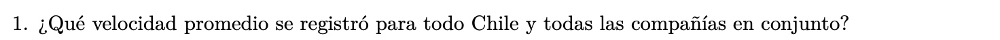

```{r}
mean(BandaAncha$Velocidad)
```

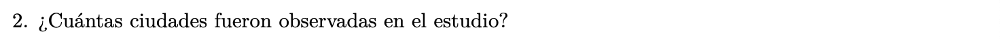

```{r}
nrow(table(BandaAncha$Ciudad))
```

o

```{r}
length(unique(BandaAncha$Ciudad))
```

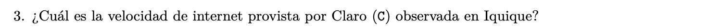

```{r}
mean(BandaAncha[BandaAncha$Operador == "C" & BandaAncha$Ciudad == "Iquique", ]$Velocidad)
```

o

```{r}
muestra1 <- subset(BandaAncha, BandaAncha$Operador == "C" & BandaAncha$Ciudad == "Iquique")
mean(muestra1$Velocidad)
```

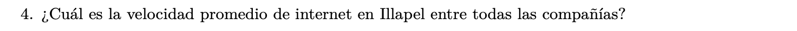

```{r}
mean(BandaAncha[BandaAncha$Ciudad == "Illapel", ]$Velocidad)
```

o

```{r}
muestra1 <- subset(BandaAncha, BandaAncha$Ciudad == "Illapel")$Velocidad
mean(muestra1)
```

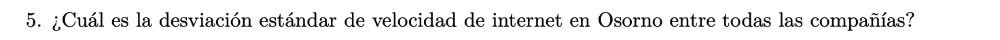

```{r}
sd(BandaAncha[BandaAncha$Ciudad == "Osorno", ]$Velocidad)
```

o

```{r}
sd(subset(BandaAncha, Ciudad == "Osorno")$Velocidad)
```

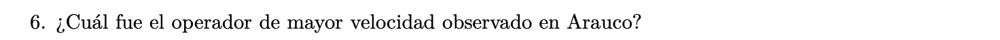

```{r}
max_velocidad <- max(BandaAncha[BandaAncha$Ciudad == "Arauco", ]$Velocidad)
BandaAncha[BandaAncha$Velocidad == max_velocidad & BandaAncha$Ciudad == "Arauco", ]$Operador
```

o

```{r}
indice <- which.max( subset(BandaAncha, Ciudad == "Arauco")$Velocidad)
BandaAncha$Operador[indice]
```

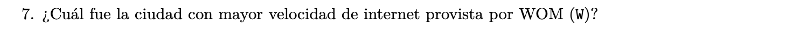

```{r}
max_velocidad <- max(BandaAncha[BandaAncha$Operador == "W",]$Velocidad)
BandaAncha[BandaAncha$Velocidad == max_velocidad & BandaAncha$Operador == "W", ]$Ciudad
```

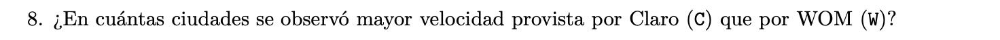

```{r}
cantidad <- 0

for (i in 1:nrow(BandaAncha)){
  for (j in 1:nrow(BandaAncha)){
    if (BandaAncha$Ciudad[i] == BandaAncha$Ciudad[j] & BandaAncha$Operador[i] == "C" & BandaAncha$Operador[j] == "W" & BandaAncha$Velocidad[i] > BandaAncha$Velocidad[j]){
      cantidad <- cantidad + 1
    }
  }
}
cantidad
```

o

```{r}
claro <- subset(BandaAncha, Operador == "C")
wom <- subset(BandaAncha, Operador == "W")
nrow(subset(claro, Velocidad > wom$Velocidad))
```

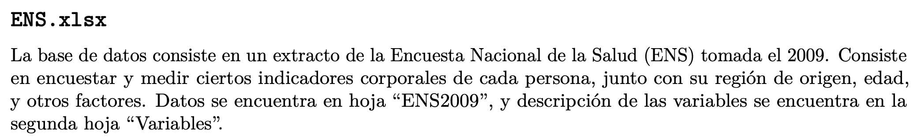

```{r}
ENS <- read_excel('Data/ENS.xlsx')
```


```{r}
nrow(subset(ENS, ENS$EDAD == 21))
```


```{r}
mean(ENS$COLES)
```


```{r}
sd(ENS$PESO)
```


```{r}
nrow(subset(ENS, ENS$HDL > 40))
```


```{r}
nrow(subset(ENS, ENS$TGD >= 120 & ENS$TGD <= 200))
```


```{r}
nrow(subset(ENS, ENS$PESO < 60))/nrow(ENS)
```


```{r}
nrow(subset(ENS, ENS$FUMADOR == 1))/nrow(ENS)
```

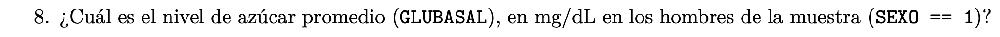

```{r}
mean(subset(ENS, ENS$SEXO == 1)$GLUBASAL)
```

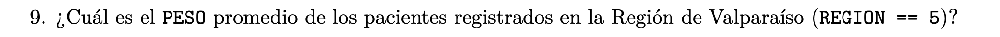

```{r}
mean(subset(ENS, REGION == 5)$PESO)
```

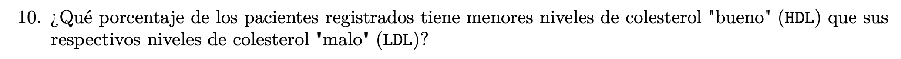

```{r}
nrow(subset(ENS, HDL < LDL))/nrow(ENS)
```

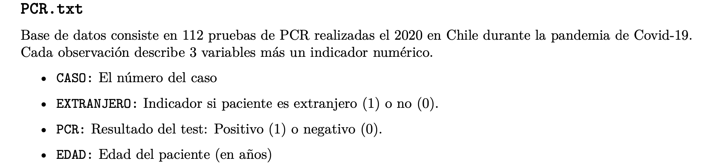

```{r}
PCR <- read.delim("Data/PCR.txt", header = TRUE)
```


```{r}
nrow(subset(PCR, EXTRANJERO == 1))/nrow(PCR)
```


```{r}
max(PCR$EDAD)
```


```{r}
nrow(subset(PCR, EXTRANJERO == 1 & PCR == 1))/nrow(subset(PCR, EXTRANJERO == 1))
```


```{r}
nrow(subset(PCR, EDAD <= 40)) / nrow(PCR)
```


```{r}
min(subset(PCR, PCR == 1)$EDAD)
```


```{r}
nrow(subset(PCR, EDAD == 59 & PCR == 1))
```

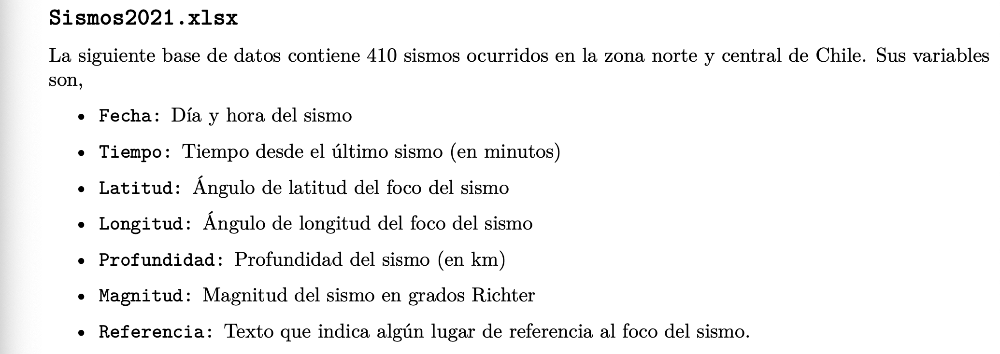

```{r}
Sismos2021 <- read_excel('Data/Sismos2021.xlsx')
```


```{r}
nrow(subset(Sismos2021, Tiempo >= 60))
```

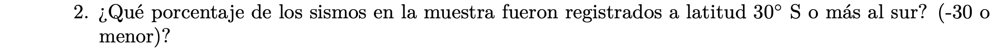

```{r}
nrow(subset(Sismos2021, Latitud <= -30))/nrow(Sismos2021)
```


```{r}
nrow(subset(Sismos2021, Magnitud <= 3 & Tiempo >= 60*3))
```


```{r}
Sismos2021$Magnitud[which.max(Sismos2021$Profundidad)]
```


```{r}
quantile(Sismos2021$Tiempo, probs = c(.9))
```

o

```{r}
quantile(Sismos2021$Tiempo, .9)
```


```{r}
quantile(subset(Sismos2021, Magnitud >= 4)$Profundidad, 0.8)
```
