# Ejercicios control 1

## Sumatorias


```
sum(c(1:10))
```
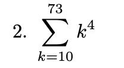
```
v1 <- c(10:73)
suma <- 0
for(i in v1){
  suma <- suma + i**4
}
suma
```
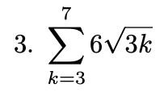
```
v1 <- c(3:7)
suma <- 0
for(i in v1){
  suma <- suma + 6*sqrt(3*i)
}
suma
```

```
v1 <- c(1:21)
suma <- 0
for(i in v1){
  suma <- suma + log(i/10)
}
suma
```

```
v1 <- c(1:100)
suma <- 0
for(i in v1){
  suma <- suma + 1/i
}
suma
```
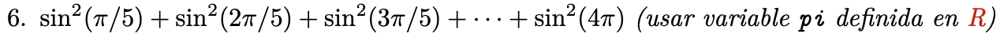
```
v1 <- c(1:20)
suma <- 0
for(i in v1){
  suma <- suma + sin(pi*i/5)**2
}
suma
```

## Probabilidades

DISTR corresponde a la distribucion que se esta utilizando. Por ejemplo, alguna de las siguientes:


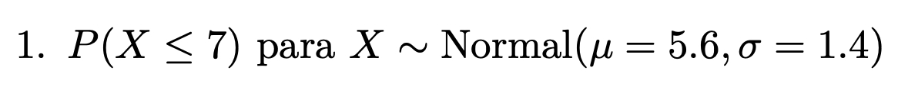
```
muestra1 <- pnorm(7, mean=5.6, sd=1.4)
muestra1
```

```
muestra1 <- pexp(3, 0.4)
muestra2 <- pexp(6, 0.4)
muestra2 - muestra1
```

Como es discreta al restar la probabilidad hasta el 8 con la que es hasta el 4 perdemos la info de la probabilidad del 4
```
muestra1 <- ppois(4, 7)
muestra2 <- ppois(8, 7)
dato1 <- dpois(4, 7)
muestra2 - muestra1 + dato1
```
o
```
muestra1 <- ppois(3, 7)
muestra2 <- ppois(8, 7)
muestra2 - muestra1 
```


```
primos <- c(2,3,5,7,11,13,17,19)
suma <- 0
for(i in primos){
    suma <- suma + dbinom(i, 20, 0.3)     
}
suma
```

## Bases de datos


```
Caldera <- Abalon$centro == "Caldera"
cantidad <- sum(Caldera)
cantidad
```
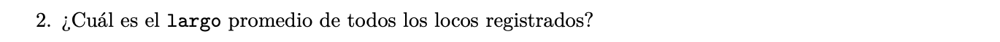
```
suma_largos <- sum(Abalon$largo)
cantidad <- nrow(Abalon)
promedio <- suma_largos/cantidad
promedio
```

```

```

```

```

```

```
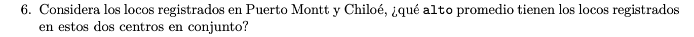
```

```

```

```

```

```

```

```


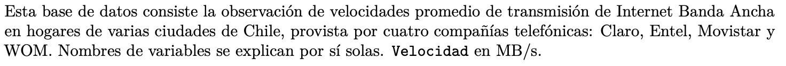

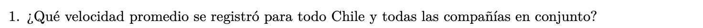
```
{r}

```
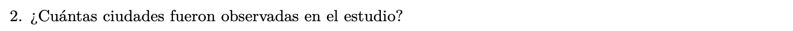
```
{r}

```

```
{r}

```
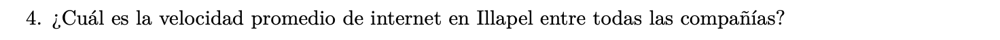
```
{r}

```
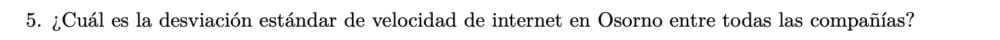
```
{r}

```

```
{r}

```
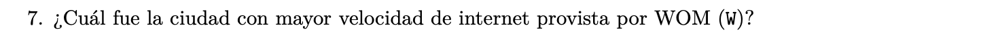
```
{r}

```

```
{r}

```