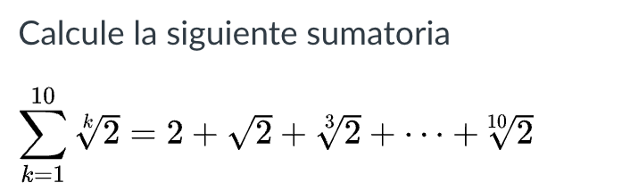
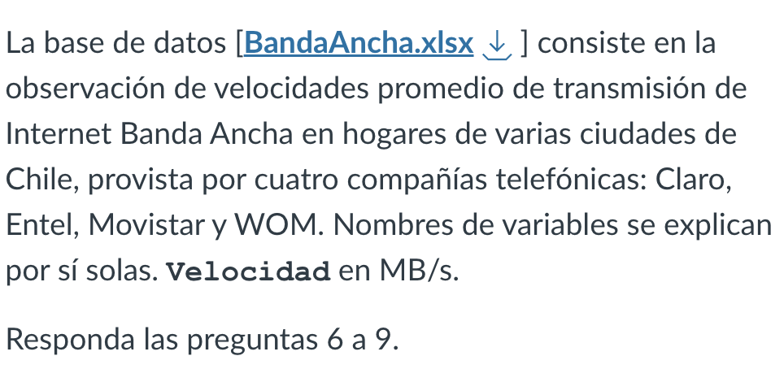
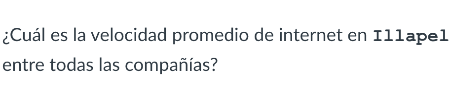

# Ensayo control 1

```{r}
library(readxl)
```

```{r}
BandaAncha <- read_excel("Data/BandaAncha.xlsx")
```

### Pregunta 4

```{r}
2+2
2*sqrt(2)
10**2+10**3+10**0+10**1
```

### Pregunta 5

```{r}
v <- c(1:10)
v <- 2**(1/v)
sum(v)
```

## Bases de datos

### Pregunta 7

```{r}
mean(BandaAncha$Velocidad)
```

### Pregunta 8

```{r}
mean(subset(BandaAncha, Ciudad == "Illapel")$Velocidad)
```

### Pregunta 9

```{r}
claro <- subset(BandaAncha, Operador == "C")
wom <- subset(BandaAncha, Operador == "W")
nrow(subset(claro, Velocidad > wom$Velocidad))
```
