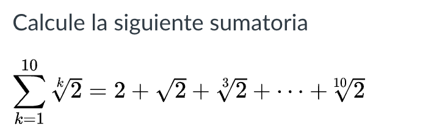
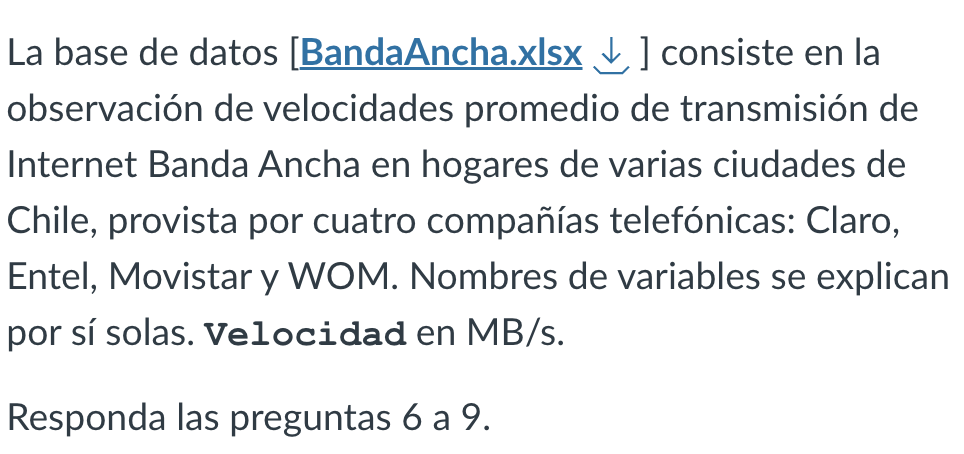

Ensayo C1
================
2023-09-24

# Ensayo control 1

``` r
library(readxl)
```

``` r
BandaAncha <- read_excel("Data/BandaAncha.xlsx")
```

### Pregunta 4

``` r
2+2
```

    ## [1] 4

``` r
2*sqrt(2)
```

    ## [1] 2.828427

``` r
10**2+10**3+10**0+10**1
```

    ## [1] 1111

### Pregunta 5



``` r
v <- c(1:10)
v <- 2**(1/v)
sum(v)
```

    ## [1] 12.48093

## Bases de datos


/
### Pregunta 7 


``` r
mean(BandaAncha$Velocidad)
```

    ## [1] 11.23052

### Pregunta 8


``` r
mean(subset(BandaAncha, Ciudad == "Illapel")$Velocidad)
```

    ## [1] 10.674

### Pregunta 9


``` r
claro <- subset(BandaAncha, Operador == "C")
wom <- subset(BandaAncha, Operador == "W")
nrow(subset(claro, Velocidad > wom$Velocidad))
```

    ## [1] 27
